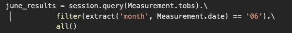
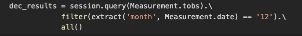
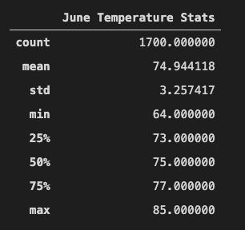
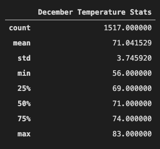
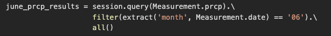
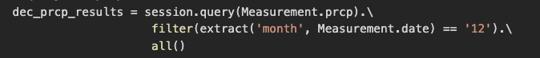
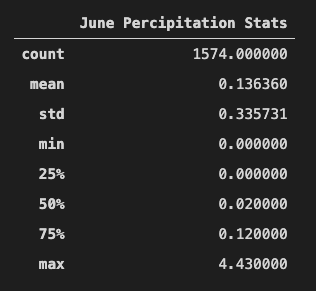
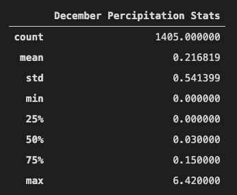

# Surfs_Up

*****
*****

* By: Tyler Sojka
* November 2020
* Sql Query with SQLalchemy, SQLite database, python, pandas, and a dash of flask

*****
*****

## Overview

ALOHA! We have been dreaming of a life selling ice cream and surfing supplies throughout the beautiful islands of Hawaii, specifically, the island of Oahu, and now is our chance! With the help of an investor named W. Avy, our dreams are becoming closer to reality every day. The only caveat? W. Avy wants some data analysis to be assured of his investment.

W. Avy wants us to analyze weather data acquired from various weather stations across Hawaii. He has supplied us with a SQLite database containing temperature and precipitation recordings from 9 different stations. Using SQLalchemy, we will make a connection to the SQLlite database and query the temperature and precipitation records using SQLalchemy. Finally, we will create a web page to present our findings to W. Avy's board of directors using flask.

## Results

W. Avy requested that we analyze the data and give him a summary of the temperature data for the months of June and December, from 2010-2017. To do this all we had to do was preform the following query to get all of the temperature readings in the month of June, and simply refactor for the month of December: (June and December respectively)

Once the data was queried, the next step was to import it into a pandas DataFrame. Once transformed, we simply returned a summary of statistics on the DataFrame. Below are the statistic summaries for June and December respectively.

As you can tell from the stats, there are a few minor, but key differences between the two months.

1. There are roughly 200 less temperature readings in December than in June
    * This likely has little effect on any analysis due to each weather station taking up to multiple readings per day.
  
2. The minimum temperature is about 8 degrees cooler in December than in June.
   * This alone doesn't say much about the data.

3. The average temperature in December is about 5 degrees cooler than in June.
   * This difference would not likely cause anyone to not buy an ice cream cone!

## Summary

With all of the temperature analysis done, it's safe to say that Oahu is a prime location for an ice cream and surf shop. The weather year-round is relatively stable. Even in December the average temperature is a pleasant 71 degrees, plenty warm enough for an ice cream, and some surfing. While there may be a few days where the temperature dips down into the mid 50's, the average December temperature is still roughly the same as the average temperature in June. This bodes well for any ice cream and surf shop!

While we have the analysis for the temperature, one more factor should be considered: precipitation, and in our case, rainfall. Quickly refactoring our previous temperature queries, we can perform the same analysis for rainfall. 

Just like before, we have the queries for June and December, respectively. Preforming the same procedure as before, we loaded the query results into a pandas DataFrame and got our statistics summary. Below is the summary for June and December, respectively.

As you can see from the statistics summaries, rain fall is very similar in both months. December does have a larger max rainfall, and while the average December rainfall is almost double that of Junes average, 1 tenth of an inch is not significant. Apart from those two differences, both are very similar. combined with the mild temperatures, there is plenty of rain fall to keep the flora luscious, while not raining out any days in paradise. Investing in this business is a... perfect 10!
